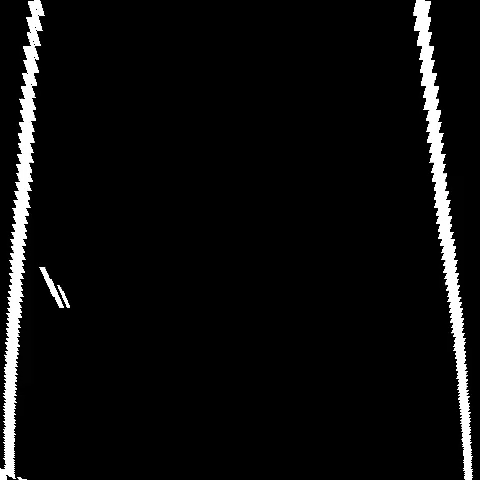

# 3차 자율주행 경진대회


## 1. 역할

| 이름 | 담당 |
|:-|:-|
| 한찬영 | 트랙 주행, 장애물 통과 |
| 변성목 | 트랙 주행, 기능 통합 |
| 오상윤 | 횡단보도, 주차구역 |
| 정수림 | 자동 노출도 조절, 주차구역 |


## 2. 기능 통합

- CAM으로부터 얻은 영상은 총 5개의 기능에 활용된다. 하지만, 이 영상은 모든 기능에 동시에 사용되는 것은 아니고, 미션에 따라 아래와 같이 순차적으로 처리된다.
    - 1. 현재 영상에 대한 광도 확인
    - 2. 주차구역 확인
    - 3. 횡단보도 확인
    - 4. 트랙 주행
- 따라서 책임 연쇄 패턴을 사용하여, 각 기능별로 Handler를 구현하고, 각 Handler에 필요한 정보들을 따로 구성하였다. 이때 필요한 정보의 내용들은 Xycar에서 얻어온 센서값, CAM 이미지, 현재 트랙의 바퀴수, 모터에 요청한 속도와 조향각 값 등을 담고있다.
- Handler 폴더는 Info 통해 직접 모터의 속도와 조향각을 계산하는 부분이고, Module 폴더는 각 Handler를 돕기 위한 각종 클래스와 함수들로 구성되어 있다.
- 아래 폴더 구조에 맞추면, 서로 다른 튜닝을 하더라도 main함수를 건드릴 일 없이 업데이트할 수 있다.

```text
soha_workspace
└── src
    # 3차 자율주행 경진대회 코드
    └── rally_3rd
        └── src
            ├── __init__.py
     
            # 실행 코드
            ├── main.py

            # 책임 연쇄를 위한 각 미션에 대한 handler
            ├── handler
            │   ├── __init__.py
            │   ├── handler.py                  # Handler 추상 클래스
            │   ├── ar_parking_handler.py       # AR 주차
            │   ├── sliding_window_handler.py   # Sliding window와 Lidar를 활용한 장애물 회피 주행
            │   └── stop_line_handler.py        # 정지선 멈춤
     
            # 각 미션 수행에 사용되는 실제 코드
            ├── module
            │   ├── __init__.py
            │   
            │   # 각 기능에 필요한 데이터를 담는 정보
            │   ├── infos
            │   │   ├── __init__.py
            │   │   ├── ar_info.py
            │   │   ├── handler_info.py
            │   │   ├── motor_info.py
            │   │   └── ultrasonic_info.py
            │
            │   # 각 센서 정보를 받기 위한 ROS Subscriber
            │   ├── subscribers
            │   │   ├── __init__.py
            │   │   ├── ar.py
            │   │   ├── camera.py
            │   │   ├── lidar.py
            │   │   └── ultrasonic.py
            │   
            │   # 각 센서 정보를 받아서 관리하는 manager
            │   ├── ros_manager.py
            │
            │   # AR 주차
            │   ├── ar_parking
            │   
            │   # 카메라 자동 노출
            │   ├── exposure
            │   │   └── save                    # 학습 모델
            │
            │   # 장애물 회피 주행
            │   ├── lidar_drive
            │
            │   # Sliding Window 주행
            │   ├── sliding_window
            │
            │   # 정지선 멈춤
            │   ├── stop_line
            │
            │   # 필터 및 튜닝 도구
            │   └── utils
            │
            
            # 영상처리를 위한 파라미터
            └── params
                ├── calibration
                └── image_processing
```


## 3. 트랙 주행


### 3.1 Bird-eye view

CAM으로부터 프레임을 받아오면 OpenCV의 Adaptive Threshold 알고리즘으로 차선을 걸러내고, 슬라이딩 윈도우를 적용하기 위해 빨간색 ROI 영역만큼 Bird-eye view로 바꾼다.

| 원본 | Bird-eye View |
|:-:|:-:|
|||


### 3.2 Sliding Window

본래의 슬라이딩 윈도우 방식은 영상 하단부터 고정된 크기의 윈도우가 겹쳐지지 않게 쌓아 올라가는 방식인데, 여기서는 조금 다른 방식을 사용했다.

1. 초록색 구간은 좌/우 하단과 좌/우 측면으로 나뉘어 있는데, 우선 좌/우 하단부터 확인한다.
2. 좌/우 하단의 초록색 구간의 바깥부터 안쪽으로 흰색 픽셀을 검사한다. 이 때, 흰색 픽셀이 윈도우 크기의 20% 이상 감지될 경우, 그 영역을 윈도우의 시작점으로 설정한다. 윈도우의 시작점은 여러 개가 될 수 있다.
3. 윈도우의 시작점이 설정되면, 다음 윈도우를 찾기 위해 아래와 같이 검사를 진행한다.
    - 검사하는 영역의 크기는 윈도우의 2배로 하고, 검사 영역의 중심 하단을 윈도우의 중점에 맞춘다.
    - 검사 영역에 흰색 픽셀이 윈도우 크기의 20% 이상 감지될 경우, 그 영역을 다음 윈도우 설정한다.
    - 다음 윈도우는 여러 개가 될 수 있다. (Flood fill 알고리즘)
4. 서로 다른 윈도우의 시작점으로 부터 여러 개의 트리 모양의 윈도우가 생성되면, 가장 깊은 트리의 높이 20개가 넘는지를 확인한다.
    1. 20개가 넘을 경우, 가장 많은 윈도우를 가진 트리를 선택하고, 그 윈도우의 중점을 기준으로 2차함수를 생성한다.
    2. 20개가 넘지 못할 경우, 좌/우 측면의 초록색 구간을 기준으로 위의 작업을 반복한다.

| Sliding Window | Polynomial curve fitting |
|:-:|:-:|
|||


## 4. 보완해야 할 점과 아쉬웠던 점

1. 슬라이딩 윈도우의 높은 연산 비용 문제
    - 트랙 주행을 하기 위해서 위의 방식으로 사용할 경우, 연산 비용이 많아서 33fps에서 11fps로 줄어든다. Hough Line 방식을 사용할 경우, 약 20fps가량 확보된다고 한다.
    - 때문에, 주행 중에 상황을 충분히 인식하고 대응을 하지 못하는 문제 때문에 약간의 트랙 이탈이 발생하였다.
    - Flood Fill 알고리즘 대신 간단한 방법을 사용하여 fps를 높일 수 있었다면, 좀 더 안정적인 성능이 나왔을 것으로 보인다.
    - 낮은 fps라고 하더라도 차선 검출의 정확도를 우선시하여 연산 비용을 높였는데, 만약 60% 정도의 정확도를 가지면서 높은 fps를 확보했다면 어땠을까 하는 생각도 든다.
    - trade-off 문제를 풀지 못한다면, Hough Line 방법을 튜닝하는 것이 더 나았을 지도 모른다.
2. 캘리브레이션 문제
    - 각 미션을 수행하기 위한 튜닝은 진행됬지만, 가장 기본적은 캘리브레이션은 다시 확인하지 못했다.
3. 노출도 문제
    - 위의 예시 영상을 보면 전체적으로 밝은 것을 알 수 있는데, 노출도를 좀 더 낮추는 편이 영상처리에 유리하다고 했다.
    - 수림님이 진행한 자동 노출도 조절 기능이 이 부분을 보완하기 위한 것이었는데, 실제 노출도를 조절해보면서 검증하는 시간이 없던 점이 아쉬웠다.


## 5. 느낀 점
- 위의 기능을 모두 켰을 때 평균 10fps 정도가 나왔음에도, 가장 늦게 도착했지만 모든 미션을 수행하면서 완주까지 했다. (감격:grin:)
- 실시간 문제에 대해 확인해야 할 것들이 trade-off 관계를 빠르게 확인해야 한다는 것을 배웠다.
- 가장 소홀한 것처럼 보이는 기본 작업을 확실히 하지 않고 나중에 수정하려고 하면, 추가된 기능들이 제대로 동작하지 않을 것 같은 두려움 때문에 더 이상 손쓸 수 없이 방치된다는 것을 알게 되었다.